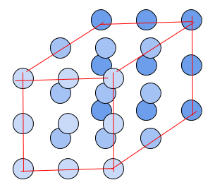

# Multicellular Reservoir Computer

A simulation of a reservoir computer comprising of a tissue of cells.

By default, cells are arranged in an approximate cube:

{ width=50% }

Throughout the simulation, the input signal comes from one face of the simulation space, varying between low and high levels and stimulating the tissue. The cells that receive the signal communicate with other cells using cytokines and propagate the information to the cell layer on the other side. A number of cells on the other side are used as output, and LASSO linear regression is trained on their gene values.

{ width=75% }

The number of cell layers along the input-signal-to-output-layer dimension can be changed in which case, every cell layer is an approximate square.

Each cell simulates gene regulation with a random boolean network. The number of cell types can be specified, where every cell type has its own boolean network topology and every cell is assigned a random cell type. Every cell has a randomized initial state for all of its genes.

{ width=80% }

Within the boolean network, the first gene is reserved for the input signal value, received from the environment. The following N genes are reserved for cytokines input, one gene for each of N cytokines. These genes switch on when the environment cytokine level is above the specified threshold. Another N genes are reserved after that for cytokine output, secreting the cytokine if the gene is switched on. The rest of the genes comprise the internal genes of the cell, implementing the logic of the boolean network. Genes are randomly wired, with the condition that the input genes can only be read from and that the cytokine output genes can only be written to.

{ width=100% }

## Running the simulation

`run` is the main driver script for the simulation. Passing `--help` option will display all the configurable parameters.

## Running sensitivity analysis

In the `cell_rc_utils` directory, run the scripts in the following order:
`generate_args` to generate arguments for a number of simulations using Latin Hypercube Sampling.
`run_args` to run simulations in parallel.
`gather_results` to combine all the results into a single `results.csv` file.
`sensitivity_analysis` to perform the analysis.
