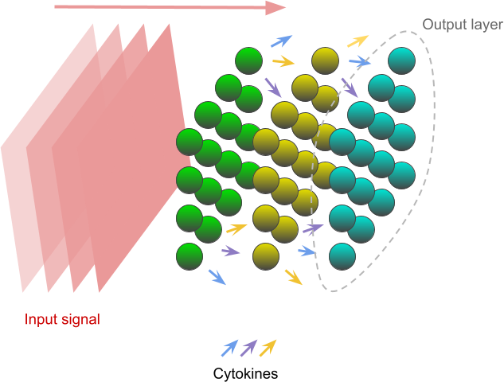

# Multicellular Reservoir Computer

A simulation of a reservoir computer comprised of a community of cells.

Cells are arranged in square layers along the input signal source axis. Throughout the simulation, the input signal comes from one face of the simulation space, varying between low and high levels and stimulating the cell community. The cells that receive the signal communicate with other cells using extracellular signaling molecules (ESMs) and propagate the information through further layers. A number of cells on the other side are used as output, and LASSO regression is trained on their gene values.

Each cell simulates gene regulation with a random boolean network. The number of cell strains can be specified, where every strain has its own boolean network topology and every cell is assigned a random strain. Every cell has a randomized initial state for all of its genes.

Within the boolean network, the first gene is reserved for the input signal value, received from the environment. The following N genes are reserved for ESMs input, one gene for each of N ESMs. These genes switch on when the environment ESM level is above the specified threshold. Another N genes are reserved after that for ESM output, secreting the ESM if the gene is switched on. The rest of the genes comprise the internal genes of the cell, implementing the logic of the boolean network. Genes are randomly wired, with the condition that the input genes can only be read from and that the ESM output genes can only be written to.

## Manuscript data and plots

`analysis/` directory contains all the simulation generated data for the manuscript in `data/*.csv` files and plots in `plots/*.png` files. To regenerate the plots, run the `plot-all` script. Plotting requires the following software:
- Unix-like OS
- R (Tested with version 4.1.3) with tidyverse and stringi packages
- Python 3 (Tested with version 3.8; package requirements in requirements.txt)
- wkhtmltopdf (Tested with version 0.12.6)
- imagemagick (Tested with version 7.1.0-29)

## Running the simulation(s)

### Requirements
- Unix-like OS
- C++14 compliant compiler (GCC 6.1+ or Clang 3.4+)
- Python 3 (Tested with version 3.8; package requirements in requirements.txt)

In the root directory, `run` is the main driver script for running a simulation. Passing `--help` option will display all the configurable parameters. `run` will automatically build the the simulation before running it. You can also build it yourself by running `make` in the `model/` directory.

The `run-args` script uses, if present, the `args.csv` file and runs the simulations in parallel for each set of arguments, one per row. The `args.csv` file is generated by the `generate-args` script. Run `generate-args --help` for information on how to provide the parameters. This approach was used to generate all the data for the manuscript, as it saves time compared to running each simulation individually.

The following sections describe how to run the simulations to generate the manuscript data. However, the data generated for the manuscript was run on powerful HPC machines and took a number of days. Running all the simulations on a personal computer is unlikely to be feasible timewise, but running individual simulations is possible for testing. The steps described in the following sections also show where to find the simulation output data already generated for the manuscript plots.

## Running sensitivity analysis

In the root directory, run the scripts in the following order:
- `generate-args sensitivity_analysis` to generate arguments (in `args.csv` file) for a number of simulations using Latin Hypercube Sampling. For the data showed in the manuscript, the arguments used are at `args/args-sensitivity-analysis.csv` which can be used by simplying copying it into the root dir: `mv args/args-sensitivity-analysis.csv args.csv`.
- `run-args` to run simulations in parallel. Adjust the number of processes and threads to the capabilities of the machine (`run-args --help for extra information`). The results are stored in `results.csv`.
- `mv results.csv analysis/` to move the results to the `analysis/` directory. The `results.csv` file used for manuscript plots can be found at `analysis/data/results-sensitivity-analysis.csv`
- `sensitivity-analysis results.csv` in `analysis/` dir to perform the analysis.

### Other analyses

In the `multicell_rc_utils/` directory:
- `generate-args parameter_combination` to generate arguments (in `args.csv` file) for all combinations of provided parameters. This requires specifying the parameters and the value ranges. For the data showed in the manuscript, the arguments used are in the `args/` directory.
- `run-args` to run simulations in parallel. Adjust the number of processes and threads to the capabilities of the machine (`run-args --help for extra information`) The results are stored in `results.csv`.
- `mv results.csv analysis/` to move the results to the `analysis/` directory. The `results.csv` files used for manuscript plots can be found in `analysis/data/` directory.
- Plot the data using the plotting scripts in the `analysis/` directory. `analysis/plot-all` runs all the necessary scripts for plotting and requires the `.csv` files to be in `analysis/data/` directory.
