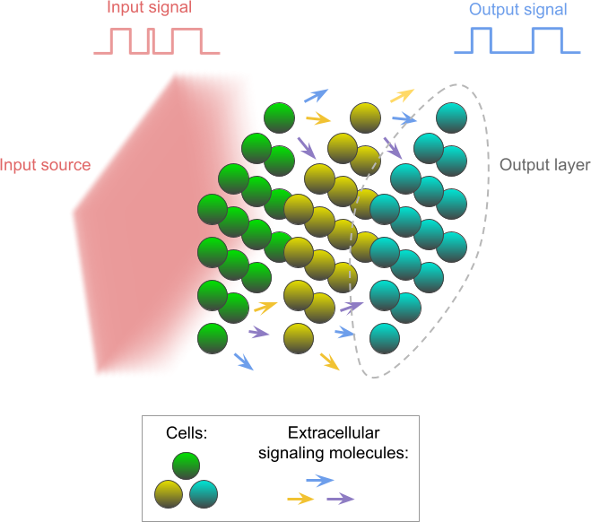
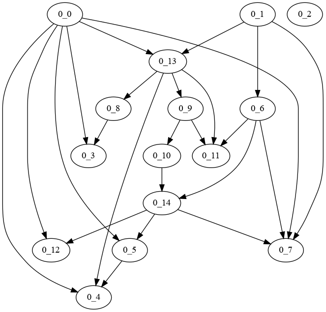
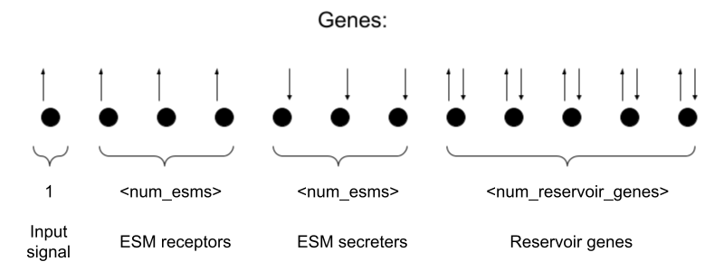

# Multicellular Reservoir Computer

A simulation of a reservoir computer comprised of of a community of cells.

Cells are arranged in square layers along the input signal source axis. Throughout the simulation, the input signal comes from one face of the simulation space, varying between low and high levels and stimulating the cell community. The cells that receive the signal communicate with other cells using extracellular signaling molecules (ESMs) and propagate the information through further layers. A number of cells on the other side are used as output, and LASSO regression is trained on their gene values.

Each cell simulates gene regulation with a random boolean network. The number of cell strains can be specified, where every strain has its own boolean network topology and every cell is assigned a random strain. Every cell has a randomized initial state for all of its genes.

Within the boolean network, the first gene is reserved for the input signal value, received from the environment. The following N genes are reserved for ESMs input, one gene for each of N ESMs. These genes switch on when the environment ESM level is above the specified threshold. Another N genes are reserved after that for ESM output, secreting the ESM if the gene is switched on. The rest of the genes comprise the internal genes of the cell, implementing the logic of the boolean network. Genes are randomly wired, with the condition that the input genes can only be read from and that the ESM output genes can only be written to.

## Requirements

- Unix-like OS
- C++14 compliant compiler (GCC 6.1+ or Clang 3.4+)
- Python 3.8+ (package requirements in requirements.txt)

## Running the simulation

`run` is the main driver script for the simulation. Passing `--help` option will display all the configurable parameters.

## Running sensitivity analysis

In the `multicell_rc_utils` directory, run the scripts in the following order:

- `generate-args sensitivity_analysis` to generate arguments for a number of simulations using Latin Hypercube Sampling.
- `run-args` to run simulations in parallel.
- `sensitivity-analysis` to perform the analysis.

## Other analyses

In the `multicell_rc_utils` directory:

- `generate-args parameter_combination` to generate arguments for all combinations of provided parameters. Run `generate-args --help` for information on how to provide parameters.
- `run-args` to run simulations in parallel. The results are stored in `results.csv`.
